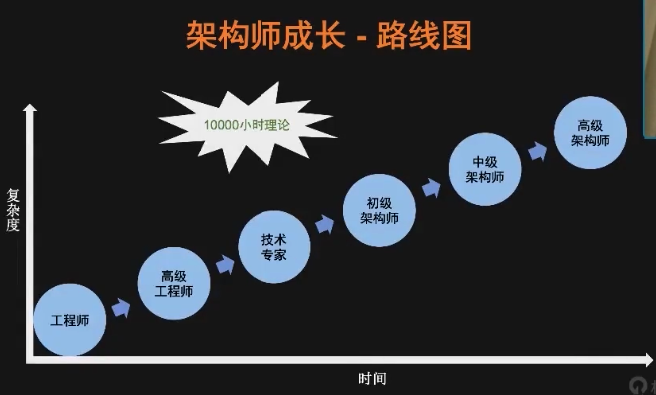
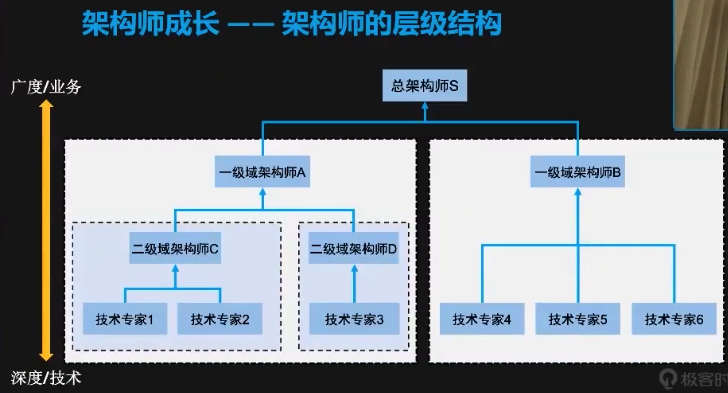

# 阿里P9分享——从程序员到架构师，最佳技术成长之路

##### 来源:极客时间分享
- 主题：《软件架构师成长漫谈》
- 讲师：李运华，前阿里资深技术专家
    - 15年工作经验：5年华为，8年UC，2年蚂蚁金服
- 视频：https://www.bilibili.com/video/BV1Bt4y1i7f4
- PPT材料：https://ppt.infoq.cn/slide/show?cid=65&pid=2910

##### 架构设计核心理念

- 思维模式：判断 + 取舍 + 创造
- 设计原则：合适原则 + 简单原则 + 演进原则
- 简单原则：
    - 若无必要，勿增实体（奥卡姆剃刀）
    - 复杂度：平衡内部复杂度与外部复杂度
- 演进原则：
	- 软件系统与建树本质的差异是什么？
		- 建筑建造完成以后架构是几乎不变的，而软件架构是变化的
	- 演进的目的：传承基因，适应变化

##### 架构师成长路线图

- 要点：时间积累、复杂度提升、10000小时理论
- 路径：初级工程师——高级工程师——技术专家——初级架构师——中级架构师——高级架构师

### 架构师成长指南
##### 工程师
- 特点
  - 1-3年
  - 求指导
  - 基础
    - 环境
    - 工具
    - 流程
- 碎片化时间，系统化学习
- 经典书籍系统学习：运行环境、编程语言、网络基础
- 三大坑：编译原理，XX内核代码，XX算法代码

##### 高级工程师
- 特点
    - 2-5年
    - 独当一面
    - 经验
        - 业务
        - 套路
        - 原理
- 掌握基础原理：JVM，开源软件等
- 学习套路：分库分表、缓存、SOLID、设计模式、MVP等
- 禁忌：贪大求全，看了很多，但都是蜻蜓点水

##### 技术专家
- 特点
    - 4-8年
    - 领域专家
    - 技术深度+宽度
        - 深度
        - 全面
        - 业界
- 熟悉核心源码：成熟的开源软件，Memcache、Reids、Nginx、Netty等
- 业界交流：参加技术大会，关注大厂技术
- 禁忌：生搬硬套，直接拷贝大厂技术

##### 初级架构师
- 特点
    - 5-10年
    - 构建普通系统
    - 方法论
        - 复杂度驱动
        - 风险驱动
        - 领域驱动
- 架构对比：Redis vs Memecache，Nginx vs Apache，Vue vs React等
- 架构重构：尝试去重构已有的系统
- 禁忌：过于依赖以往成功经验

##### 中级架构师
- 特点
    - 8+年
    - 构建复杂系统
    - 技术本质
        - 理论
        - 算法
        - 原理
- 技术理论：CAP、BASE、分布式快照算法等
- 技术原理：磁盘（Kafka）、CPU和内存（Disruptor）等
- 禁忌：好大喜功，过度设计，炫技式设计

##### 高级架构师
- 特点
    - 10+年
    - 架构模式
    - 创造
        - 业务
        - 技术
        - 文化
- 要点：讲师暂时无法给出答案～

##### 架构师层级结构图

### 听完分享的一点感悟
- 最大的感触是，比较遗憾在刚开始工作的时候没有听到类似的分享，后面其实走了不少弯路、学习成长的思路也不够清晰明确。
- 简单评估了一下我自己的情况，大概是介于李运华老师所说的高级工程师和技术专家之间的水平。
- 回顾了一下我过去的学习成长经历，在因缘巧合之下接触了很多技术，但是掌握不够深刻：
    - 大学期间，电子信息专业，打了一些基础、但是基础不是很牢固、很多东西学完没有实践和大量练习，然后就忘了
        - 学过C、C++、数据结构与算法、操作系统、计算机网络基础
        - 没有学过计算机组成原理、Java、软件工程
    - 2014年毕业到2017年，是技术成长很快的时期
        - 主要是写Ruby语言，熟悉了大量的Ruby框架、插件，写了不少单元测试，读了一点Rails的源码和Ruby的实现原理
        - 掌握了开发的基本流程规范，以reviewee和reviewer的角色大量参与CodeReview
        - 熟练使用了MySQL、Redis、MongoDB，了解了一些原理和性能调优的方法并付诸实践
        - 能使用Kafka、ElasticSearch、ELK日志体系
        - 初步接触Golang、Java
        - 非常积极地参与到技术分享中，并努力找机会给开源社区贡献代码
    - 2018到2019年，技术广度和技术管理能力提升较多、技术深度提升不够，拓宽了视野、但是不够精进
        - 大概管理一个10人到20人之间的技术团队，因此比较多精力投入在技术管理方面
        - 开始调研、学习和使用比较多新技术：K8s（ETCD、Scheduler、APIServer、Node、Pod等大量概念与技术）、Docker、ServiceMesh（Envoy、Linkerd、Istio）、Prometheus、OpenTracing、Golang、gRPC、云原生等等
        - 开始接触和熟悉微服务理念以及各种相关组件：服务拆分、配置中心、API网关、可观察性体系等
    - 2020年，比较系统地进行一些学习和练习
        - 加深对架构设计的理解、学习与实践，如：DDD领域驱动设计、《架构整洁之道》等并在实战中运用
        - 加深对编程语言、框架、基础原理的掌握，加强对计算机基础知识的理解与掌握（算法/网络/操作系统等）
        
 ##### KISS
 借用最近学到的KISS方法（Keep/Improve/Start/Stop），分享一下我个人的一些总结与改进。
 
 - Keep：继续保持的动作
    - 推动和组织团队的技术分享、CodeReview，加强和大家的交流与互相学习
    - 保持学习的热情与激情，努力输出——分享、开源
    - 关注技术社区、关注行业技术发展趋势
    
 - Improve：改进的动作
    - 坚持每天学习一点点，贵在坚持，坚持就是胜利！
    - 碎片化的时间，系统化的学习；减少零散的博客学习，以系统地读书、练习为主；当前深入学习Java、Spring框架。
    - 坚持锻炼
 
 - Start：开始启动的动作
    - ABC（Always Be Coding），每天至少进行10分钟代码编程练习，保持手感。（不会编码的技术架构师注定被淘汰！）
    - 开始做切实有效的计划并形成PDCA闭环，不要过于理想化、不要好高骛远。
    - 建立自己的知识体系与方法论，形成知识的框架结构
    
 - Stop：停止的动作
    - 停止漫无目的地学习与浏览信息
    - 停止过度娱乐，要有适当放松但是要保持适可而止（影视剧、游戏）
 